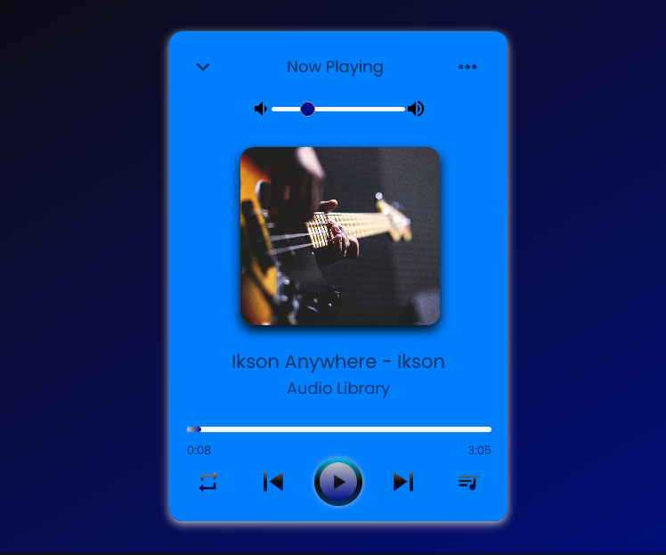

<h1>Music Player :headphones:</h1>

<h2>A music player created using only HTML, CSS, and JavaScript. </h2>

This website is created using flexbox and CSS custom properties using JavaScript to run the functions. I created this following the tutorial of CodingNepal. I've changed the color scheme and I added a volume slider to control the volume of the music as well as updated the values of measures from px to rem. I learned a lot about how to program the songs to function when you press certain buttons to do certain things using JavaScript as well as how complicated it can get to get your JavaScript to function when there is a lot of code to go through.

### Link

- Live Site: [Music Player](https://leslielopez25.github.io/Music-Player-JavaScript/)

### Screenshot

